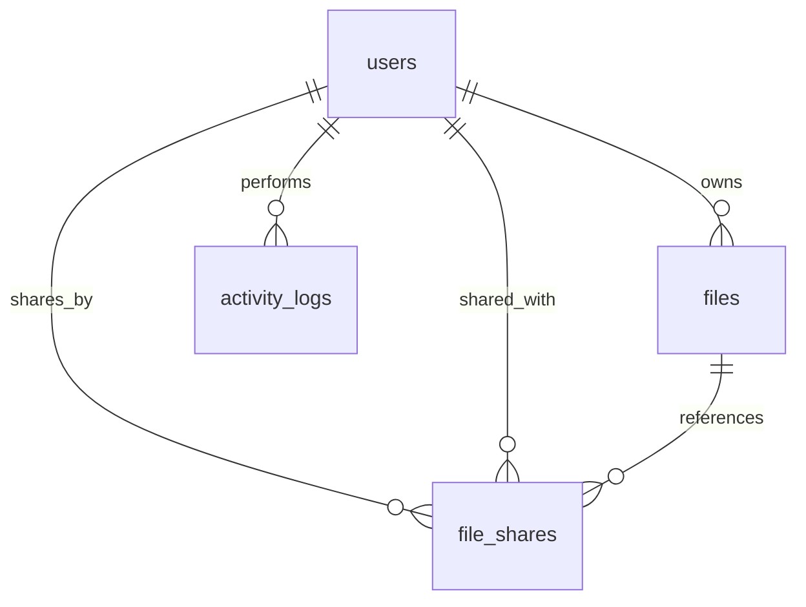

# CloudStack - Secure File Hosting & Collaboration

CloudStack is a premium, relational **PHP and MySQL** web application designed to act as a secure personal file storage vault and document collaboration platform. It offers a complete user system (registration, session-restricted access), secure metadata-tracked file uploads, logical and physical file deletion, dynamic file sharing with selective permissions, and a state-of-the-art Administrative Control Panel.

---

## Core Features

### 1. Secure Authentication & Security
*   **User Registration & Unified Forms**: Integrated sign-up system with matching-passwords check and database conflicts checking.
*   **Secure Hashing**: Passwords are saved as secure hashes using `password_hash()` with the **BCrypt** algorithm.
*   **Session Access Guards**: Reusable authorization gates (`auth_check.php`) prevent guests from accessing pages under `dashboard/`, `files/`, or `logs/`.

### 2. Secure File Vault (Upload & Storage)
*   **Format Constraints**: Enforces constraints to allow only secure, non-executable extensions (`PDF`, `DOCX`, `JPG`, `PNG`, `ZIP`).
*   **Storage Caps**: Verifies file size limits (5 MB maximum) on the server side.
*   **Preventing Overwrites & Traversal**: Uploaded files are renamed using cryptographically secure unique identifiers (`time() + random_bytes() + extension`) before being physically stored in the `uploads/` directory, preventing directory traversal and file name collisions.

### 3. File Operations
*   **Secure Downloads**: A secure downloader streams files directly from the filesystem using custom HTTP headers (hiding physical file paths) after verifying that the requester is either the owner, an administrator, or has received share authorization.
*   **Physical & Logical Deletion**: Deleting a file cleans the record from the database, cascades shared access, and physically deletes (`unlink`) the file from the server's drive.

### 4. Dynamic Collaboration (File Sharing)
*   **Sharing Controller**: Users can choose any other active system user to share documents with.
*   **Access Permissions**: Granular authorization levels:
    *   `VIEW ONLY`: Allows the recipient to view metadata details on their dashboard without download links.
    *   `DOWNLOAD ALLOWED`: Grants full permission to download and save the file.
*   **Duplicate Bypass**: Sharing a file with a user a second time elegantly updates their permission level rather than failing.

### 5. Administrative diagnostic Panel
*   **Real-Time Diagnostics**: Stats counters rendering total active users, file count, and aggregate server storage consumption (calculated dynamically in Megabytes).
*   **User Administration**: Admins can review active system users and delete accounts, cascading to physically purge their files and clear relational rows.
*   **System activity Log**: Live audit trails displaying recent system-wide actions.

### 6. Personal Activity Logs
*   A chronological logs explorer letting users review their sign-ins, file uploads, deletions, and sharing history, while admins can review global event logs.

---

## 🗄️ Database Architecture

The system runs on the relational database `cfhms_db`, consisting of four tables linked via cascading foreign keys:



### Table Definitions:
1.  **`users`**: Stores client attributes (ID, username, email, hashed password, role (`admin`/`user`), and signup date).
2.  **`files`**: Stores metadata for stored elements (ID, owner reference, original name, randomized unique storage name, extension, file size, and upload date).
3.  **`file_shares`**: Resolves collaboration permissions (ID, target file reference, sender reference, recipient reference, permission type (`view`/`download`), and share date).
4.  **`activity_logs`**: System audit trail (ID, actor reference, event action name, event descriptions, and timestamp).

---

##  Directory Structure

```bash
Cloudstack/
├── admin/
│   └── delete_user.php        # Deletes user accounts and cascades files/shares
├── assets/
│   └── css/
│       └── style.css          # Premium Glassmorphic stylesheet
├── auth/
│   ├── login.php              # Sign-in page with brand header wrappers
│   ├── logout.php             # Terminates active sessions and logs actions
│   └── register.php           # Sign-up page with UI forms and validations
├── config/
│   └── database.php           # Establishes connection to MySQL (mysqli)
├── dashboard/
│   ├── admin_dashboard.php    # Admin statistics, user list, and live system log
│   └── user_dashboard.php     # Vault table, file actions, and shared folders list
├── files/
│   ├── delete.php             # Secure physical and database deletion handler
│   ├── download.php           # Secure authorized streaming downloader
│   ├── files.php              # Secure backend file upload processing engine
│   ├── share.php              # File sharing form linking active system users
│   ├── share_file.php         # Database sharing permission insertion backend
│   └── upload_form.php        # Premium drag-and-drop styled upload zone
├── includes/
│   ├── auth_check.php         # Security guard enforcing session requirements
│   ├── footer.php             # Reusable dynamic footer layout
│   ├── header.php             # Reusable navigation panel header
│   └── logger.php             # Reusable database event logging handler
├── logs/
│   └── activity_log.php       # Event logs page for clients and administrators
├── uploads/                   # Physical vault storing renamed files
└── database.sql               # Core SQL schema with database table rules
```

---

## ⚙️ Local Deployment Guide

Follow these steps to run CloudStack locally:

### 1. Prerequisites
Ensure you have a local web server environment installed, such as:
*   **XAMPP** (recommended)
*   **WAMP**
*   **MAMP**

### 2. Project Setup
1.  Copy the `Cloudstack/` folder and paste it into your local server's document root:
    *   **XAMPP**: `C:\xampp\htdocs\Cloudstack`
    *   **WAMP**: `C:\wamp64\www\Cloudstack`
2.  Ensure that the server has write permissions for the `uploads/` directory so it can store uploaded files.

### 3. Database Initialization
1.  Start your **Apache** and **MySQL** services in the XAMPP Control Panel.
2.  Open your browser and navigate to `http://localhost/phpmyadmin`.
3.  Click **Import** on the top menu.
4.  Choose the `database.sql` file located in the root of the `Cloudstack` folder.
5.  Click **Import** (or **Go**). This will create the database `cfhms_db` and all four tables.

### 4. Database Connection Configuration
Open `config/database.php` and verify the settings match your local environment credentials:
```php
$host = 'localhost';
$db_user = 'root'; // Your MySQL username
$db_pass = '';     // Your MySQL password (empty by default on XAMPP)
$db_name = 'cfhms_db';
```

### 5. Accessing the Application
Open your browser and go to:
*   **Login**: `http://localhost/Cloudstack/auth/login.php`
*   **Register**: `http://localhost/Cloudstack/auth/register.php`
